```{=html}
<style>
body {
text-align: justify}
</style>
```
```{r include=FALSE}
knitr::opts_chunk$set(cache = F)
```

# 1. Tree ensemble models

First, the usual steps:

-   Loading libraries
-   starting h2o server
-   loading data, and creating partitions
-   training benchmark model (simple tree)

We can see the results here.In this decision tree what we can see is, that by far the most important predictor whether a customer purchases Citrus Hill or Minute Maid OJ, is whether they have a customer brand loyalty to Citrus Hill or not. It appears at almost every decision point.

We know that GBM builds sequential trees where each tree is built on the residuals of the former and the first tree is build on an initialized residual vector, which is based on the distribution of the target. The prediction value here is the correction (or predicted value of the single tree where it is trying to predict the residuals of the former), which is why we can see negative values.

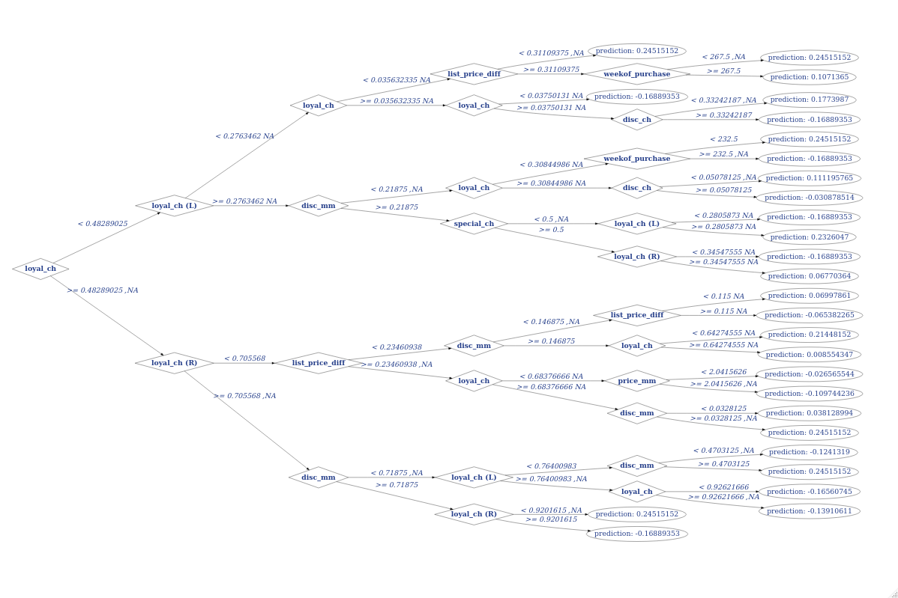

It is a bit difficult to interpret this correction term, therefore I ran a randomForest model too, so we can inspect the predictions, which are much easier to interpret, since these trees are built independently, not sequentially. Here the predictions can be interpreted as is, so the probability of them purchasing Citrus Hill.

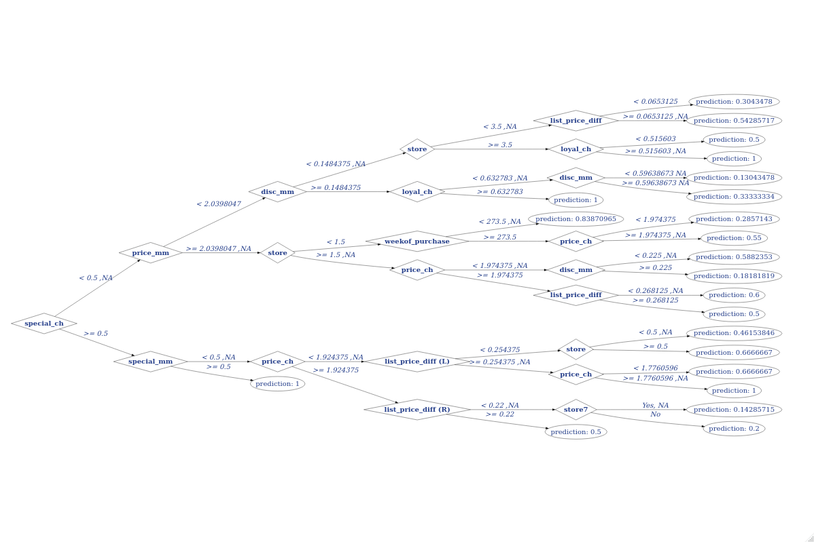

In the table below we can see the performance of the three models I trained on the CV dataset. The benchmark model performs significantly worse, than any of the models. The GBM had the best performance with a marginal lead over RF and XGB.

```{r message=FALSE, warning=FALSE, echo=FALSE}
library(kableExtra)
cv_aucs <- read.csv("out/ex1_cv_auc.csv") 
names(cv_aucs) <- c("Model Name", "AUC")
kable(cv_aucs) %>% kable_styling(full_width = F)
gbm_test_auc <- readLines("out/ex1_gbm_test_auc.txt")
```

The AUC of GBM on the test set is `r gbm_test_auc`.˛ This is very close to the CV AUC, which means the model is well trained, does not over-fit the data too much but has strong predictive power. We can see on the AUC ROC that it is better than average model.

<center>

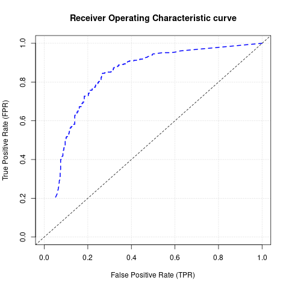

</center>

Let us take a look at the variable importance plots now. We can see that the top 3 most important variables are the same in all three. The difference is the proportion. Random forest is the most extreme in this case, it uses `loyal_ch` the most, while XGBoost is the most conservative, using comparatively much more variables to make splits. GBM is somewhere in the middle. It seems like, XGBoost is the most regular, very similar to an exponential curve, Random Forsest has the sharpest drop, but after that has an even decline in importance, and Gradient Boosting has a sharp drop, then a level decline, and again, a small drop.

<center>

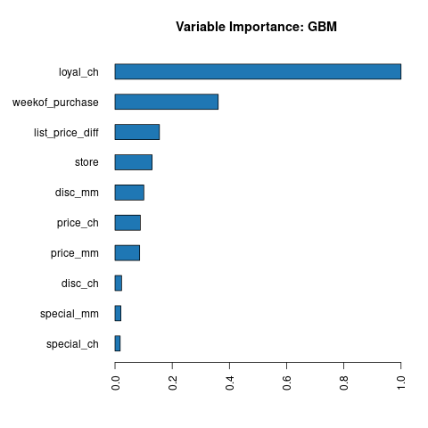

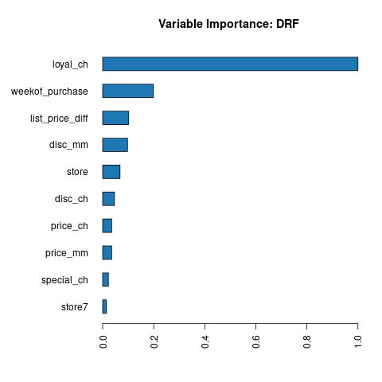 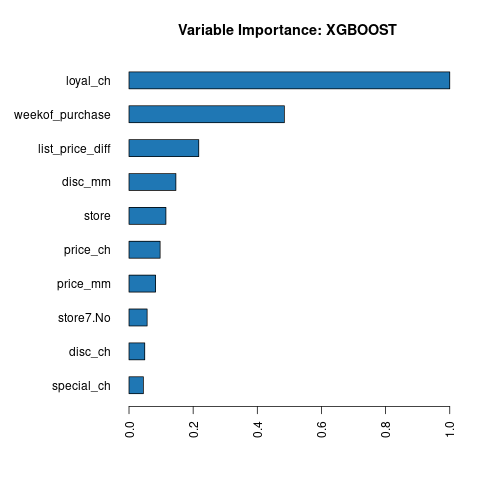

</center>

# 2. Variable importance profiles

**Random Forest models:**

The first model had the opportunity to choose from fewer variables at each split (mtries = 2). Therefore the variable importance is more distributed, because there were less randomly chosen variables, which means the trees are more decorrelated, as the variables they used different for splits are more random. While the other tree has a more uniform variable importance distribution, using the `CatBat` more substantially more frequently than any other variable. This might not be inherently bad for the model, we would have to see the performance metrics, to evaluate the difference between the two models.

<center>

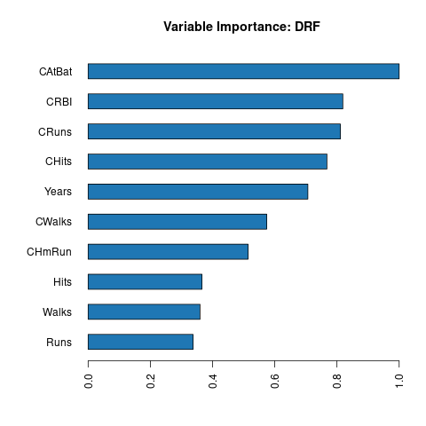 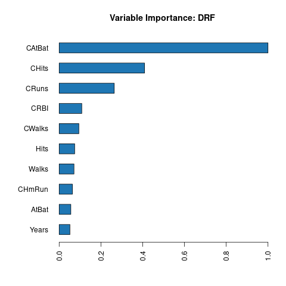

</center>

**Gradient Boosting Machines:**

The same difference can be seen here between GBM1 and GBM2, altough the reason behind the difference is not exactly the same. The sampling rate in this case means row sampling. This is essentially the parameter for bagging. A lower sampling rate uses fewer rows at each split, which in turn leads to more different trees in the end. This is what we see here, that in the first model (`sampling_rate = 0.1`) the variable importance is more equally distributed, while at the second model (`sampling_rate = 1`), it is more uniform. In this case, however, using a lower sampling rate (between 30-50% or 50-80% depending on use-case) leads to better out-of-sample predictive performance.

<center>

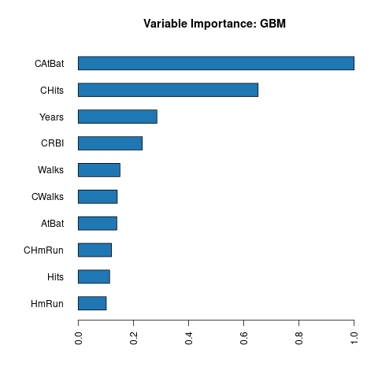 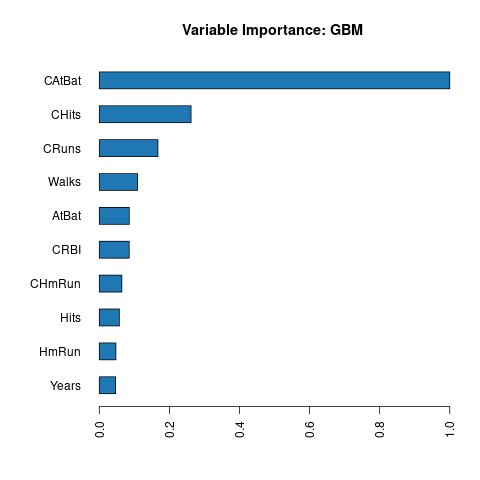

</center>

# 3. Stacking

Let's start again with the usual steps:

-   loading libraries
-   starting h2o server
-   loading data, and creating partitions
-   training benchmark model (GBM)

```{r include=FALSE}
benchmark_gbm_auc <- readLines("out/ex3_benchmark_auc.txt")
base_learners_auc <- read.csv("out/ex3_base_learners_auc.csv") 
names(base_learners_auc) <- c("Base Learner", "AUC")
```

I chose GBM as my benchmark, as in my experience this model had a fairly strong performance in itself (AUC = `r benchmark_gbm_auc`). Let's see if we can outperform it using an ensemble.

Now let's train three different models, on top of which we can create our ensemble. For these three base learners I chose a GLM, Random Forest and a Deeplearning model. We can see in the table below, that their performance is very close to GBM. The model scores are correlated very highly.

```{r echo=FALSE}
kable(base_learners_auc) %>% kable_styling(full_width = F)
ensemble_auc <- readLines("out/ex3_ensemble_auc.txt")
ensemble_test_auc <- readLines("out/ex3_ensemble_auc_test.txt")
```

<center>

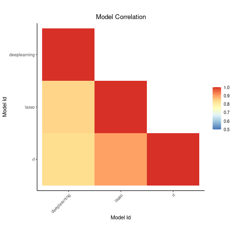

</center>

Now let's train the ensemble model on the predictions of the base learners and evaluate its performance on the validation set. The AUC of the ensemble model is `r ensemble_auc`, which is better than any individual base learner. This is still a pretty weak model, but I think we can say that it improved our prediction significantly. However, it is worth to take a look at the ROC. Here we can see, that our ensemble doesn't perform better in every case than for example our RF or even LASSO. So, when deploying this model it is imperative to first check the expected loss, using the loss function defined by our use case to see which model performs better. In this example, I chose the best model based on raw performance score (AUC), therefore I am going to evaluate the ensemble on the test set.

<center>

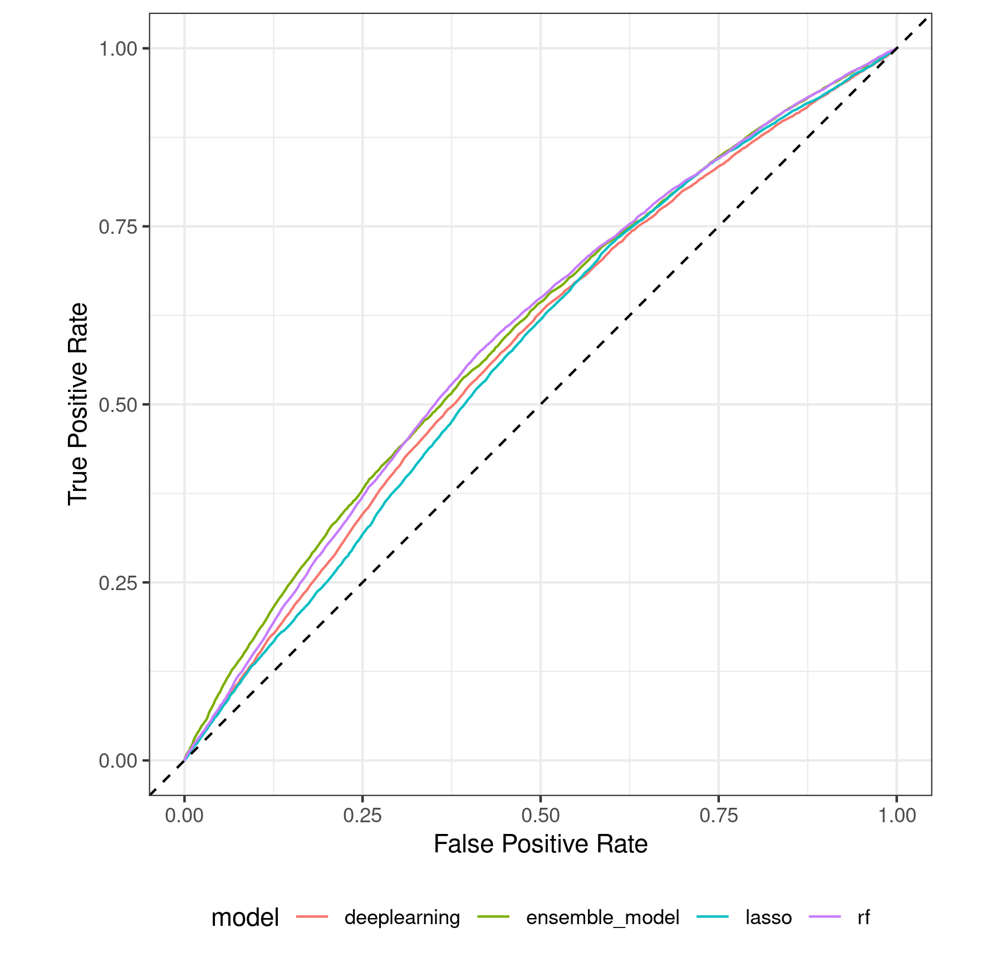

</center>

When we run the model on the test set we get an AUC score of `r ensemble_test_auc`. This is slightly worse than on the validation set, which is expected, and still better than the benchmark on the CV set. We can see the ROC curve on the test set compared to the benchmark model.

All in all, ensemble models provide a powerful solution to improve model performance, even with well trained models.

<center>

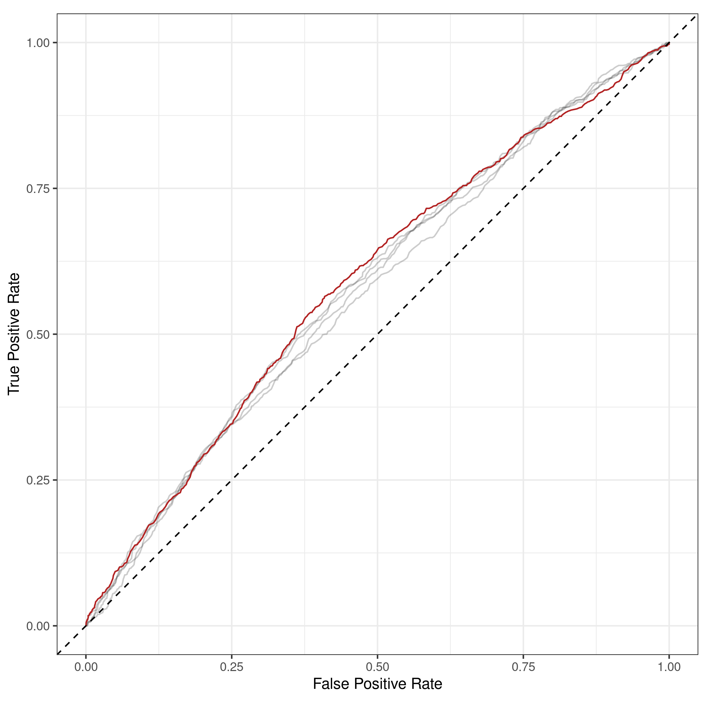

</center>
