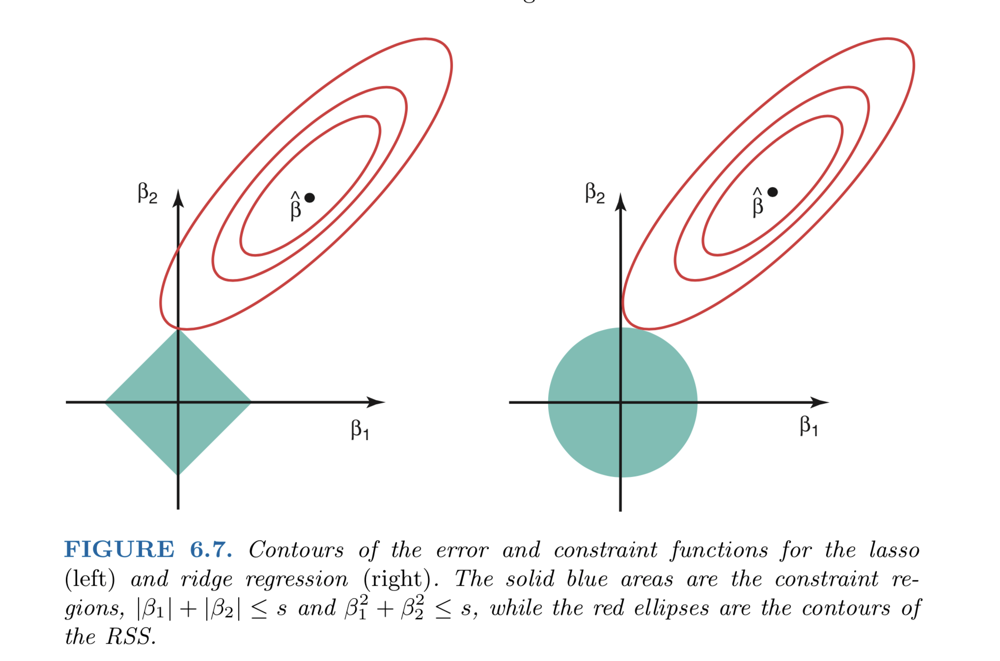

```{r}
library(data.table)
library(ggplot2)
library(GGally) # ggplot extensions, install if it is missing
library(caret)
library(magrittr)
library(skimr)
library(janitor)  # for data cleaning purposes
library(glmnet)   # the main package for penalized linear models

theme_set(theme_bw())   # globally set ggplot theme
```

Disclaimer: this lab borrows lots of ideas and examples from [this](https://afit-r.github.io/regularized_regression) great tutorial.

## Data: Ames Housing dataset

We are going to predict house sales prices in Ames, Iowa. See [here](https://cran.r-project.org/web/packages/AmesHousing/index.html).
```{r}
library(AmesHousing)
housing_data <- AmesHousing::make_ames() %>% as.data.table()
housing_data <- clean_names(housing_data)
housing_data[, log_sale_price := log(sale_price)]
skim(housing_data)
```

Look at the outcome variable, the price of houses.
```{r}
ggplot(data = housing_data, aes(x = sale_price)) + geom_density()
```
```{r}
ggplot(data = housing_data, aes(x = log_sale_price)) + geom_density()
```

Let's see correlations of features and the outcome variable. Based on this,
simple benchmark models can quickly be put together.
```{r}
ggcorr(housing_data)
```

```{r, message=FALSE}
ggpairs(housing_data, columns = c("log_sale_price", "gr_liv_area", "tot_rms_abv_grd", "garage_area"))
```

### A baseline model

```{r}
lm(log_sale_price ~ gr_liv_area + tot_rms_abv_grd, data = housing_data)
```

Weird pattern: sales price decreases with the number of rooms? This is spurious and is caused by the high positive correlation between the feature variables. Univariate regressions have the intuitive signs:

```{r}
lm(log_sale_price ~ gr_liv_area, data = housing_data)
```

```{r}
lm(log_sale_price ~ tot_rms_abv_grd, data = housing_data)
```

Penalized methods offer a solution to these kinds of patterns.

### Set up training and test (holdout) datasets

```{r}
set.seed(1234)
training_ratio <- 0.5
train_indices <- createDataPartition(
  y = housing_data[["log_sale_price"]],
  times = 1,
  p = training_ratio,
  list = FALSE
)
data_train <- housing_data[train_indices, ]
data_test <- housing_data[-train_indices, ]

fit_control <- trainControl(method = "cv", number = 10)
```

## Penalize large coefficients: the Ridge regression

```{r}
features <- setdiff(names(housing_data), c("sale_price", "log_sale_price"))
```

First we are going to directly work with the `glmnet` package to estimate 
penalized models. Then we look at how this can be implemented through `caret`.

```{r}
# glmnet needs inputs as a matrix. model.matrix: handles factor variables
# -1: we do not need the intercept as glment will automatically include it
x_train <- model.matrix( ~ . -1, data_train[, features, with = FALSE])
dim(x_train)

# standardization of variables is automatically done by glmnet

# how much penalty do we want to apply? select with CV
lambda_grid <- 10^seq(2,-5,length=100)  

set.seed(1234)
ridge_model <- glmnet(
  x = x_train, y = data_train[["log_sale_price"]], 
  family = "gaussian", # for continuous response
  alpha = 0  # the ridge model
)

plot(ridge_model, xvar = "lambda")
```

We can use cross-validation to determine the optimal penalty term weight. Two lambda values marked on the plot: one with the minimal CV RMSE, the other is the simplest model (highest lambda) which contains the optimal lambda's error within one standard deviation. That is, it gives the simplest model that is still "good enough".

```{r}
set.seed(1234)
ridge_model_cv <- cv.glmnet(
  x = x_train, y = data_train[["log_sale_price"]], 
  family = "gaussian",
  alpha = 0,
  nfolds = 10
)

best_lambda <- ridge_model_cv$lambda.min
message(paste0("The optimally chosen penalty parameter: ", best_lambda))

highest_good_enough_lambda <- ridge_model_cv$lambda.1se
message(paste0("The optimally chosen penalty parameter: ", highest_good_enough_lambda))
```

```{r}
plot(ridge_model_cv)
```

We can also use `caret` to estimate ridge models. This lets us compare it later to any
other model estimated with caret, using, for example, cross-validation with exactly the
same folds.

```{r, message=FALSE, warning=FALSE}
# ridge model
ridge_tune_grid <- expand.grid(
  "alpha" = c(0),
  "lambda" = seq(0.05, 0.5, by = 0.025)
)

set.seed(857)
ridge_fit <- train(
  log_sale_price ~ . -sale_price,
  data = data_train,
  method = "glmnet",
  preProcess = c("center", "scale"),
  tuneGrid = ridge_tune_grid,
  trControl = fit_control
)
```

```{r}
ridge_fit
```

```{r}
ggplot(ridge_fit)
```

## Another variant: LASSO regression

While Ridge applies a constraint on the sum of squares of coefficients, LASSO does the same for the sum of the __absolute values__ of coefficients.

This seemingly small difference has important sconsequences: some coefficients are set exactly to zero, others are only shrunk towards zero.
```{r}
set.seed(1234)
lasso_model <- glmnet(
  x = x_train, y = data_train[["log_sale_price"]], 
  family = "gaussian",
  alpha = 1  # the lasso model
)

plot(lasso_model, xvar = "lambda")
```

```{r, warning=FALSE}
tenpowers <- 10^seq(-1, -5, by = -1)

lasso_tune_grid <- expand.grid(
  "alpha" = c(1),
  "lambda" = c(tenpowers, tenpowers / 2) 
)

set.seed(857)
lasso_fit <- train(
  log_sale_price ~ . -sale_price,
  data = data_train,
  method = "glmnet",
  preProcess = c("center", "scale"),
  tuneGrid = lasso_tune_grid,
  trControl = fit_control
)
```
```{r}
lasso_fit
```

```{r}
ggplot(lasso_fit) + scale_x_log10()
```


### Variable selection - why is it happening?

The constraints are different: LASSO's has corners, Ridge's is smooth.



## Combine Ridge and LASSO: Elastic net

We can combine both types of penalties. LASSO is attractive since it performs principled variable selection. However, when having correlated features, typically only one of them - quite arbitrarily - is kept in the model. Ridge simultaneously shrinks coefficients of these towards zero. If we apply penalties of both the absolute values and the squares of the coefficients, both virtues are retained. This method is called Elastic net.

```{r, message = FALSE, warning=FALSE}
enet_tune_grid <- expand.grid(
  "alpha" = seq(0, 1, by = 0.1),
  "lambda" = union(lasso_tune_grid[["lambda"]], ridge_tune_grid[["lambda"]])
)

set.seed(857)
enet_fit <- train(
  log_sale_price ~ . -sale_price,
  data = data_train,
  method = "glmnet",
  preProcess = c("center", "scale"),
  tuneGrid = enet_tune_grid,
  trControl = fit_control
)
```

```{r}
enet_fit
```

```{r}
ggplot(enet_fit) + scale_x_log10()
```

## Evaluate all models

For completeness, estimate the non-regularized linear model as well.
```{r, message=FALSE, warning=FALSE}
set.seed(857)
linear_fit <- train(
  log_sale_price ~ . -sale_price,
  data = data_train,
  method = "lm",
  preProcess = c("center", "scale"),
  trControl = fit_control
)
```

```{r}
resamples(
  list("linear" = linear_fit,
       "ridge" = ridge_fit,
       "lasso" = lasso_fit,
       "elastic net" = enet_fit
  )
) %>% summary()
```

### Evaluate the chosen model on holdout set

```{r}
RMSE(predict(enet_fit, newdata = data_test), data_test[["log_sale_price"]])
```

## Recommended readings

- [Tutorial of the Air Force Institute of Technology](https://afit-r.github.io/regularized_regression) - based on which this lab was put together
- [Elements of Statistical Learning](https://web.stanford.edu/~hastie/ElemStatLearn/) - the standard reference book of machine learning (freely available)
- [Introduction to Statistical Learning](http://www-bcf.usc.edu/~gareth/ISL/) - a more accessible treatment of the same material from the same authors (with R codes)
- [Applied Predictive Modelling](http://appliedpredictivemodeling.com/) - a thorough and practical guide to predictive modelling from the author of the `caret` package (with R code)
